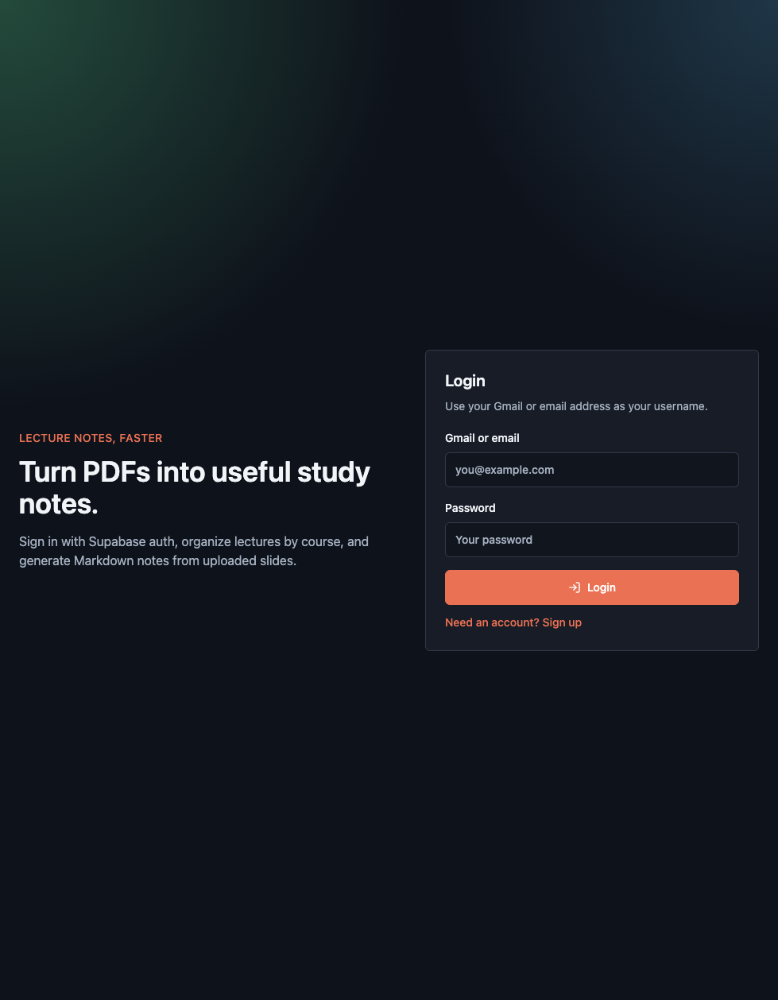
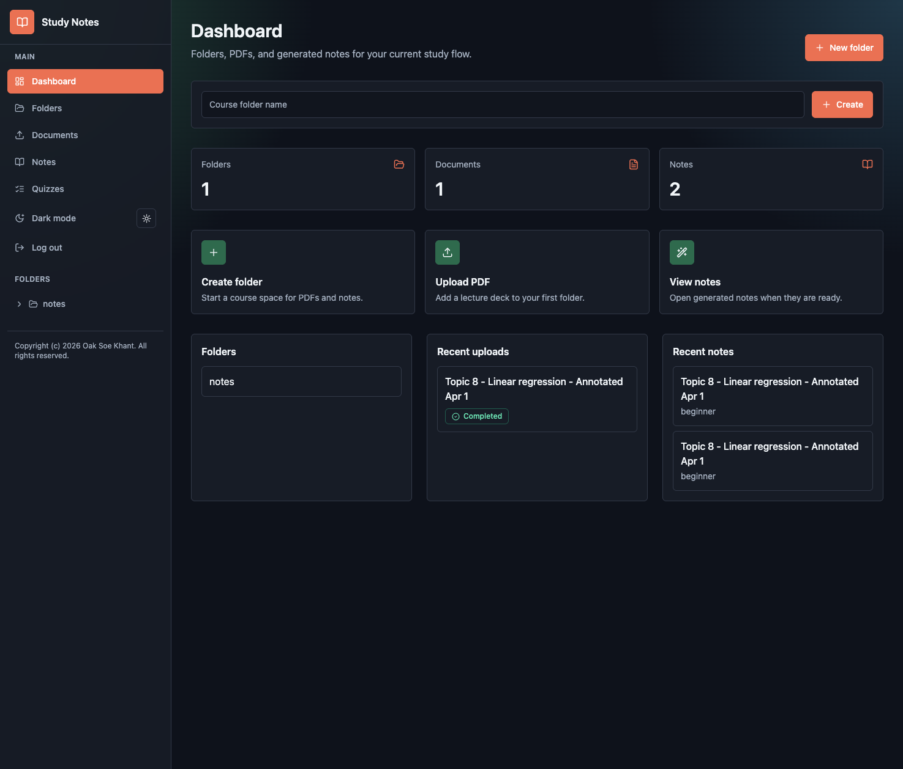
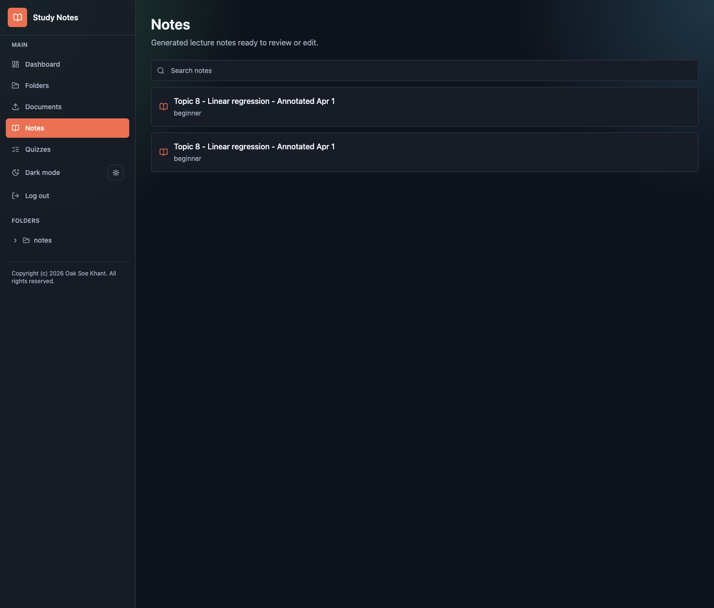
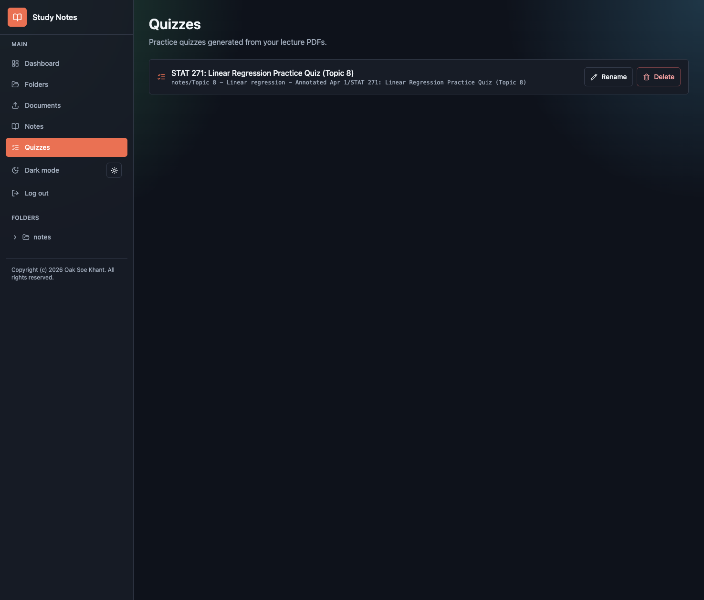

# AI Study Notes Tracker

Upload lecture PDFs, generate clean AI notes, and practice with quizzes.

Live app: [ai-study-notes-tracker.vercel.app](https://ai-study-notes-tracker.vercel.app)



## What It Does

- Upload lecture PDFs
- Extract slide text and images
- Generate Markdown notes with Gemini
- Organize notes by folder
- Generate practice quizzes from notes
- Save user data with Supabase Auth/Postgres

## How To Use

1. Log in or create an account.
2. Create a course folder.
3. Upload a lecture PDF.
4. Wait for extraction, then generate notes.
5. Open notes later or create quizzes for practice.







## Stack

- Frontend: Next.js, React, Tailwind CSS
- Backend: FastAPI
- AI: Google Gemini
- Database/Auth/Storage: Supabase
- PDF parsing: PyMuPDF

## Local Setup

```bash
cd backend
python3 -m venv .venv
source .venv/bin/activate
pip install -r requirements.txt
uvicorn app.main:app --reload --port 8000
```

```bash
cd frontend
npm install
npm run dev
```

Deployment notes live in [docs/DEPLOYMENT.md](docs/DEPLOYMENT.md).

## License

Copyright (c) 2026 Oak Soe Khant. All rights reserved.

This project is proprietary. Do not copy, distribute, modify, or reuse this code without written permission.
